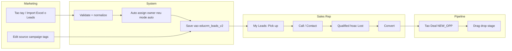
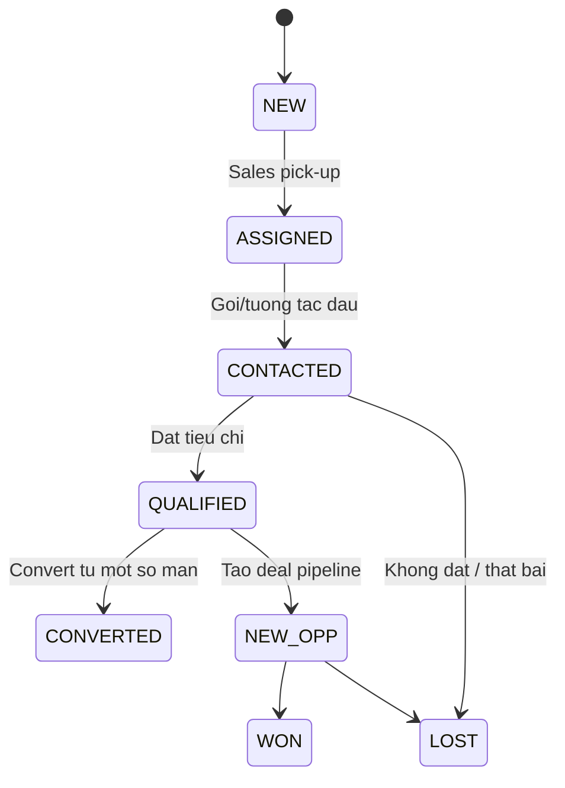

# TAI LIEU NGHIEP VU LEAD (AS-IS THEO CODE)

## 0) Muc tieu tai lieu
Tai lieu nay tra loi 3 cau hoi chinh:
- Lead vao he thong tu dau, bang cach nao?
- Lead di qua cac buoc xu ly nao tu luc vao den luc thanh Deal/Pipeline?
- Ai lam buoc nao (Marketing, Sales Rep, Leader/Admin, he thong)?

Phan vi: luong Lead trong code hien tai (frontend + localStorage), KHONG phai luong backend production.

## 1) Tom tat nhanh cho quan ly
- Luong vao LEAD dang chay that su: trang `Leads` (tao tay + import Excel).
- Luong vao qua webhook/campaign dang la UI simulation (chua ghi vao kho lead trung tam).
- Kho du lieu trung tam cho Lead: `localStorage` key `educrm_leads_v2`.
- Chuyen doi Lead -> Contact -> Deal da co, nhung logic xoa/giu Lead chua dong nhat giua cac man.

---

## 2) Ban do tac nhan (AI LAM GI)

| Tac nhan | Man hinh chinh | Vai tro trong flow | Dau ra |
|---|---|---|---|
| Marketing | `Leads`, `MarketingLeadDetails`, (mock: `CampaignDetails`) | Tao/import lead, sua thong tin marketing, gan campaign/source/tags | Lead duoc tao/cap nhat |
| Sales Rep | `MyLeads`, `SalesLeadQuickProcess`, `Pipeline`, `SalesMeetings` | Nhan lead, goi/cham soc, cap nhat trang thai, convert, day deal trong pipeline | Lead duoc xu ly, Deal duoc tao/tien trinh |
| Sales Leader/Admin | `Leads`, `AdminAutomationRules`, `SLALeadList`, `Pipeline` | Cau hinh phan bo, theo doi SLA, can thiep assign/cham lead | He thong phan bo dung rule, lead duoc dieu phoi |
| System (frontend storage) | `utils/storage.ts`, `utils/slaUtils.ts` | Luu du lieu, phat event change, tinh SLA warning, dedup contact theo SDT | Du lieu nhat quan o localStorage |

---

## 2.1 Bang phan he rieng (MODULE MATRIX)

| Phan he | Muc tieu | R/A chinh | Dau vao | Xu ly cot loi | Dau ra | Man hinh/cham code | Trang thai |
|---|---|---|---|---|---|---|---|
| Inbound Lead Core | Dua lead vao kho trung tam | R: Marketing, A: Marketing Lead/Admin | Form tao lead tay | Tao `ILead`, enrich metadata, save theo tung ban ghi | Ban ghi lead moi trong `educrm_leads_v2` | `pages/Leads.tsx` (`handleCreateSubmit`) | THUC SU |
| Import Batch Lead | Nap lead hang loat tu file | R: Marketing, A: Marketing Lead/Admin | File `.xlsx/.csv` | Parse `xlsx`, validate field, map data, enrich campaign/tags | Danh sach lead hop le duoc save bulk | `pages/Leads.tsx` (`handleFileSelect`, `validateData`, `handleImportSubmit`) | THUC SU |
| Assignment Engine | Gan lead cho sales | R: System, A: Sales Leader/Admin | Lead moi + config distribution | Auto/manual; round_robin/weighted; cap nhat index chia lead | `ownerId` duoc gan hoac de trong | `utils/storage.ts` (`get/saveLeadDistributionConfig`, `allocate*`), `pages/Leads.tsx` (`assignOwnersBySystemMode`) | THUC SU |
| Lead Triage + Dedup so cap | Lam sach lead de ban giao sales | R: Marketing, A: Marketing Lead | Danh sach lead vua vao | Group duplicate theo SDT tren UI, sua source/campaign/tags, assign tay neu can | Lead da chuan hoa, de tiep nhan | `pages/Leads.tsx`, `pages/MarketingLeadDetails.tsx` | THUC SU (dedup muc UI) |
| SLA Monitoring | Canh bao lead cham xu ly | R: System/Leader, A: Sales Leader/Admin | Leads + activity + config SLA | Tinh warning not_ack/slow/overdue/neglected/manual_sla | Danh sach warning + lich su cham | `utils/slaUtils.ts`, `pages/SLALeadList.tsx` | THUC SU |
| Sales Execution Queue | Queue tac nghiep cua sales rep | R: Sales Rep, A: Sales Leader | Lead da co owner | Pick-up, call, update status, mark lost, bulk thao tac | Lead duoc cap nhat trang thai/nhat ky | `pages/MyLeads.tsx` | THUC SU |
| Lead Detail theo role | Chia luong thao tac theo vai tro | R: Marketing/Sales/Admin, A: Team Lead tuong ung | Lead ID + role user | Route view theo role, cho phep update field theo boi canh | Lead duoc cap nhat dung workflow role | `pages/LeadDetailsRouter.tsx`, `pages/MarketingLeadDetails.tsx`, `pages/SalesLeadQuickProcess.tsx`, `pages/LeadDetails.tsx` | THUC SU |
| Convert Engine (Lead -> Contact -> Deal) | Chuyen tu pre-sales sang pipeline deal | R: Sales Rep, A: Sales Leader | Lead da du dieu kien convert | Map lead->contact, dedup contact theo SDT, tao deal `NEW_OPP`, dieu huong pipeline | Contact upsert + Deal moi | `utils/storage.ts` (`convertLeadToContact`, `addContact`), `pages/Leads.tsx`, `pages/MyLeads.tsx`, `pages/SalesLeadQuickProcess.tsx`, `pages/LeadDetails.tsx` | THUC SU (nhung KHONG dong nhat giua man) |
| Pipeline Deal | Van hanh co hoi sau convert | R: Sales Rep/Leader, A: Sales Leader | Deals + Contacts | Drag-drop stage, update deal/contact, next activity | Deal dich chuyen stage, cap nhat lien tuc | `pages/Pipeline.tsx` | THUC SU |
| Meeting/Test | Quan ly lich hen va ket qua test | R: Sales/Teacher, A: Sales Leader | Meeting draft + lead lien ket | Confirm/cancel/submit ket qua, ghi log nguoc ve lead | Meeting status + lead activity update | `pages/SalesMeetings.tsx`, `utils/storage.ts` (meeting funcs) | THUC SU |
| Integration Webhook | Cau hinh kenh ngoai vao CRM | R: Admin, A: Admin/Founder | Webhook URL, channel config | Tao/copy/regenerate URL + toggle ket noi UI | Cau hinh hien thi tren UI | `pages/AdminIntegration.tsx` | MOCK/SIMULATION |
| Campaign Data Board | Theo doi data theo campaign | R: Marketing, A: Marketing Lead | Import file campaign, nhap tay, webhook payload mau | Parse + luu trong state local component | Bang/Kanban campaign data local | `pages/CampaignDetails.tsx` | MOCK/SIMULATION |
| Import Wizard Legacy | Wizard 3 buoc import | R: Marketing, A: Marketing Lead | File upload trong wizard | Chuyen step UI va redirect | Chi dieu huong, khong persist lead core | `pages/LeadImport.tsx` | MOCK/SIMULATION |
| Data Store/Event Bus | Lop luu tru va dong bo tab/view | R: System, A: Dev team | CRUD tu cac man hinh | Luu localStorage, phat custom event `educrm:*` | Du lieu nhat quan tren client | `utils/storage.ts`, `index.tsx` (`initializeData`) | THUC SU (client-side) |

---

## 3) Nguon vao Lead (INBOUND FLOW)

## 3.1 Nguon vao THUC SU dang ghi vao CRM

### A. Tao tay tren trang Leads
- Tac nhan chinh: Marketing / Admin / Founder (co quyen vao `Leads`).
- Buoc:
  1. Mo modal tao lead.
  2. Nhap thong tin bat buoc (ten, sdt, company base...).
  3. He thong tao object `ILead` + enrich metadata (`createdAt`, `lastInteraction`, `marketingData`, `slaStatus`...).
  4. Neu mode phan bo = auto, he thong tu gan owner.
  5. Luu qua `saveLead(...)` vao `educrm_leads_v2`.
- Ket qua: lead xuat hien trong danh sach Leads va co the xuat hien trong My Leads cua sales neu owner khop.

### B. Import Excel tren trang Leads
- Tac nhan chinh: Marketing / Admin / Founder.
- Buoc:
  1. Upload file `.xlsx/.csv`.
  2. Parse bang `xlsx`.
  3. Validate theo `CRM_FIELDS`:
     - Required: ten, sdt, company.
     - Email phai co `@`.
     - SDT phai theo pattern `0xxxxxxxxx`.
  4. Normalize row hop le thanh format lead CRM.
  5. Enrich batch/tag/campaign/createdAt/sla fields.
  6. Gan owner theo mode phan bo he thong (auto/manual).
  7. Ghi hang loat bang `saveLeads([...existing, ...new])`.
- Ket qua: lead vao kho trung tam `educrm_leads_v2`.

---

## 3.2 Nguon vao DANG MO PHONG (khong ghi lead trung tam)

### C. `LeadImport` (wizard import)
- Hien trang: mo phong UI (step upload -> mapping -> finish).
- Sau "import": chi `navigate('/leads')`, KHONG goi `saveLead/saveLeads`.

### D. `CampaignDetails` (import file + manual + webhook)
- Hien trang: giu lead trong state local cua component (`const [leads, setLeads]`).
- Co parse xlsx, add lead local, kanban local.
- KHONG day vao `educrm_leads_v2`.

### E. `AdminIntegration` (webhook URL)
- Hien trang: UI tao/copy/regenerate webhook URL + connected status display.
- KHONG co receiver API va KHONG co ingest lead vao storage lead.

---

## 4) Luong xu ly Lead sau khi vao he thong

## 4.1 Luong tong quan (vai tro + handoff)

## 4.2 Route theo vai tro khi mo chi tiet lead
- `LeadDetailsRouter`:
  - Marketing -> `MarketingLeadDetails`.
  - Sales Rep / Sales Leader -> `SalesLeadQuickProcess`.
  - Role con lai -> `LeadDetails`.

Y nghia nghiep vu:
- Cung 1 lead, nhung giao dien va thao tac uu tien khac nhau theo role.

---

## 5) Flow chi tiet theo tung vai tro

## 5.1 Marketing flow (triage + quality)
- Nhiem vu:
  - Tao/import lead.
  - Chuan hoa source/campaign/tags/thong tin co ban.
  - Gan/doi owner neu can (bulk assign trong Leads).
  - Loai bo duplicate ro rang o man Leads (group theo SDT).
- Diem giao ban giao cho Sales:
  - Lead da co owner + thong tin toi thieu de sales tiep nhan.
- Dinh dang data marketing chinh:
  - `source`, `marketingData.campaign`, `marketingData.tags`, `channel`, `market`.

## 5.2 Sales Rep flow (xu ly tac nghiep)

### A. My Leads
- Data scope: chi lay lead co `ownerId === user.id`.
- Action chinh:
  1. Pick up:
     - set `status = ASSIGNED`
     - ghi `pickUpDate`
     - ghi activity log SLA pick-up dat/vi pham.
  2. Call:
     - neu lead NEW/ASSIGNED -> doi `CONTACTED`.
     - ghi activity call.
  3. Mark Lost:
     - doi `DealStage.LOST`.
  4. Convert:
     - tao Contact (co dedup SDT).
     - tao Deal stage `NEW_OPP`.
     - navigate Pipeline.

### B. SalesLeadQuickProcess (chi tiet nhanh)
- Tinh `SLA minutes left` tu `createdAt` (moc 15 phut trong man nay).
- Cho doi status nhanh: NEW/CONTACTED/QUALIFIED/UNREACHABLE/DISQUALIFIED.
- Gate khi QUALIFIED:
  - bat buoc nhieu field (name/phone/program/targetCountry/dealType/source/notes...).
- Convert tu man nay:
  - tao Contact + tao Deal + xoa Lead goc.

## 5.3 Leader/Admin flow
- Cau hinh phan bo:
  - `AdminAutomationRules` luu mode/method/weighted ratios.
- Theo doi SLA:
  - `SLALeadList` tinh warning va xem lich su cham.
- Can thiep van hanh:
  - assign lai owner, uu tien xu ly lead cham.

---

## 6) Distribution flow (AI GAN LEAD CHO SALES)

## 6.1 Cau hinh
- Luu trong `educrm_lead_distribution_config`.
- Truong chinh:
  - `mode`: `auto` | `manual`
  - `method`: `round_robin` | `weighted`
  - `roundRobinIndex`, `weightedIndex`, `weightedRatios`

## 6.2 Runtime behavior
- Khi tao/import lead trong `Leads`:
  - neu `mode = auto`: goi allocate owner.
  - neu `mode = manual`: de owner rong, doi assign tay.

### Round robin
- Chia deu theo danh sach sales reps va cap nhat con tro index.

### Weighted
- Build owner pool theo ti le %.
- Chia theo pool va cap nhat weighted index.

---

## 7) Convert flow va handoff sang Pipeline

## 7.1 Chuan convert mong doi
1. Lead du dieu kien (thuong qua QUALIFIED).
2. Map Lead -> Contact (`convertLeadToContact`).
3. Upsert Contact bang `addContact` (dedup theo SDT).
4. Tao Deal stage `NEW_OPP`.
5. Dieu huong sang Pipeline de xu ly tiep.

## 7.2 Logic dedup Contact (quan trong)
- SDT duoc normalize (chi lay so).
- Neu trung SDT va du dai:
  - merge vao contact cu (giu id cu, merge activities/dealIds).
- Neu khong trung:
  - tao contact moi.

## 7.3 Khac biet convert giua cac man (AS-IS)
- `Leads`: convert xong XOA lead.
- `SalesLeadQuickProcess`: convert xong XOA lead.
- `MyLeads`: convert xong KHONG xoa lead.
- `LeadDetails`: convert xong doi status `CONVERTED`, khong xoa lead.

Tac dong nghiep vu:
- Cung 1 case convert co the de lai lead hoac khong -> anh huong KPI, duplicate KPI, va tracking funnel.

---

## 8) State machine cua Lead

Ghi chu:
- Trong code, `status` cua lead dang cho phep vua `LeadStatus` vua `DealStage`, nen co pha tron state.

---

## 9) SLA flow (giam sat + canh bao)

## 9.1 Tinh SLA warning
- Engine: `calculateSLAWarnings(leads, currentUserId?, config)`.
- Rule mac dinh util:
  - `ackTimeMinutes = 15`
  - `firstActionTimeMinutes = 60`
  - `maxNeglectTimeHours = 72`
- Rule tai man `SLALeadList` dang default `ackTimeMinutes = 5` (override khi tinh o man nay).

## 9.2 Cac loai canh bao
- `not_acknowledged`: qua han nhan lead moi.
- `slow_interaction`: cham hanh dong dau tien sau khi nhan.
- `overdue_appointment`: qua lich hen scheduled.
- `neglected_interaction`: bo quen cham soc qua lau.
- `manual_sla`: co flag slaStatus/slaReason tren lead.

## 9.3 Ai xu ly
- Sales Rep: xu ly lead trong queue cua minh.
- Leader/Admin: theo doi danh sach cham, dieu phoi lai owner neu can.

---

## 10) Pipeline flow sau convert
- Dau vao Pipeline: danh sach `deals` + `contacts`.
- Thao tac chinh:
  - Drag-drop card qua stage -> update `deal.stage` + save.
  - Mo drawer de cap nhat thong tin lien quan contact/deal.
  - Tao next activity sau convert.

---

## 11) RACI mini (ai chiu trach nhiem)

| Buoc | R (thuc hien) | A (chiu trach nhiem cuoi) | C (tham van) | I (duoc thong bao) |
|---|---|---|---|---|
| Tao/import lead | Marketing | Marketing Lead/Admin | Sales Leader | Sales Rep |
| Cau hinh phan bo | Admin/Leader | Admin/Founder | Marketing Lead | Sales Rep |
| Pick up lead | Sales Rep | Sales Leader | Admin | Marketing |
| Cham soc + cap nhat status | Sales Rep | Sales Leader | Admin | Marketing |
| Convert lead | Sales Rep | Sales Leader | Admin | Marketing |
| Theo doi SLA | Leader/Admin | Founder/Admin | Sales Rep | Marketing |

---

## 12) Scenario E2E mau (chi tiet)

### Scenario 1: Import batch -> Sales xu ly -> Convert -> Pipeline
1. Marketing import file tren `Leads`.
2. He thong validate 200 dong -> 170 hop le, 30 loi.
3. 170 dong duoc enrich + auto assign owner theo round robin.
4. `saveLeads` vao `educrm_leads_v2`.
5. Sales Rep A vao `MyLeads` thay cac lead owner=A.
6. Sales pick-up lead #1 -> ASSIGNED, co `pickUpDate`.
7. Sales call -> CONTACTED.
8. Sales bo sung thong tin nhu cau -> QUALIFIED.
9. Sales convert -> tao/merge Contact + tao Deal NEW_OPP.
10. Dieu huong `pipeline?newDeal=...`, sales tiep tuc drag stage.

### Scenario 2: Lead cham SLA
1. Lead moi duoc tao luc 08:00.
2. Den 08:20 chua ai pick-up.
3. Engine SLA tao warning `not_acknowledged`.
4. Hien thi trong `SLALeadList` de Leader can thiep.
5. Leader reassign hoac nhac sales tiep nhan.

---

## 13) Danh sach diem nghiep vu can thong nhat (quan trong)
1. Chuan hoa 1 luong convert duy nhat:
   - Convert xong co xoa lead hay khong?
   - Neu giu lead, giu o trang thai nao va co an khoi queue khong?
2. Chuan hoa state dictionary:
   - Dang tron `LeadStatus` va `DealStage` trong cung `lead.status`.
3. Chuan hoa ingest webhook/campaign:
   - Hien tai la simulation, can flow backend neu muon "crawl tu dong" that.
4. Chuan hoa key storage khi bulk delete MyLeads:
   - Co cho dang doc `localStorage['leads']` thay vi key chuan `educrm_leads_v2`.

---

## 14) Data store + su kien he thong

## 14.1 Key storage chinh
- Lead: `educrm_leads_v2`
- Contact: `educrm_contacts`
- Deal: `educrm_deals`
- Distribution config: `educrm_lead_distribution_config`

## 14.2 Event frontend
- Sau khi ghi lead/contact/deal, storage phat custom event de cac man khac sync lai (vd `educrm:leads-changed`).

---

## 15) Tham chieu code chinh
- Inbound + import + convert: `pages/Leads.tsx`
- Sales operation queue: `pages/MyLeads.tsx`
- Sales quick detail flow: `pages/SalesLeadQuickProcess.tsx`
- Role-based detail router: `pages/LeadDetailsRouter.tsx`
- Generic detail flow: `pages/LeadDetails.tsx`
- Marketing detail flow: `pages/MarketingLeadDetails.tsx`
- Pipeline sau convert: `pages/Pipeline.tsx`
- Distribution config UI: `pages/AdminAutomationRules.tsx`
- SLA monitor: `pages/SLALeadList.tsx`
- Storage/service core: `utils/storage.ts`, `utils/slaUtils.ts`
- Mock integration/crawl UI: `pages/CampaignDetails.tsx`, `pages/LeadImport.tsx`, `pages/AdminIntegration.tsx`

---

## 16) Ket luan nghiep vu
- Neu ban can tai lieu "flow ai lam gi" de van hanh doi Sales/Marketing: file nay da du dung ngay.
- Neu ban can dung cho production: can them 1 tai lieu to-be (backend ingest/webhook, standard convert policy, state machine chuan) de chot quy trinh cuoi.
